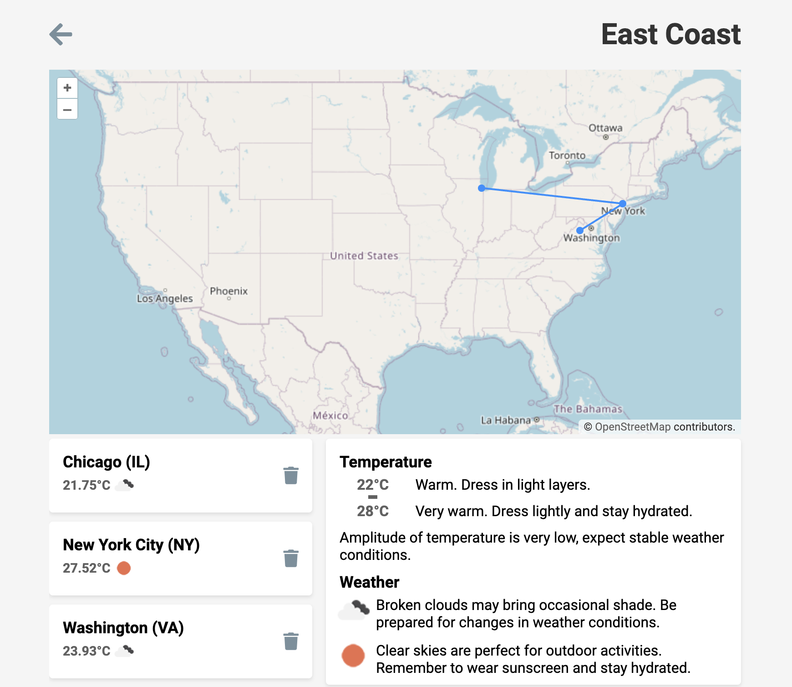

# Context
The test is sandboxed within a mock project implementing a web application to create and manage road trips in the USA.

## Requirements 
To perform this test, it is necessary to have an environment containing:
- `docker` [installation](https://docs.docker.com/get-docker/)
- `python` (optional) [installation](https://www.python.org/downloads/)

## Setup
To start the test, after cloning this repository you need to run
```
$ docker docker-compose up
```
After a few seconds, the test server and database will be available (assuming ports 80 and 5432 are available).

The app runs on [http://localhost](http://localhost)

You can now start 🙂

# Roadtrip Manager
The application contains 2 pages:

## Roadtrips View
|Url|Path|
|-|-|
|Root|/|


This page lists all available road trips and allows the user to add/delete some elements.

## Roadtrip View
|Url|Path|
|-|-|
|Specific Roadtrip|/roadtrip/<roadtrip_id>|


This page gives the details of a specific road trip. The user can manage (add/remove) the cities of this road trip and see some advice related to the current weather in those cities.

## Architecture

The project requires multiple systems to work. 
- Python Flask Framework is used to run the application 
- PostgreSQL store all informations concerning roadtrips and requirements
- OpenWeather public API is call to get the current weather
 
Both Flask and PostgreSQL are embede in the `docker-compose` environment, but OpenWeather requires an internet connection for the environment to work (the API key is the config file). 


# Questions

### Question 1 
The current city `autocomplete` mechanism doesn't seem to propose the most efficient recommendations.
Find a solution to display more relevant cities to the user.


### Question 2
Add a feature allowing to change the order of the cities in a road trip.


### Question 3
A new feature has been implemented to add advice related to the temperature in addition to those concerning the weather. 

You need to do the code review of the branch [feature_1_temperature_guide](https://github.com/geofberard/tech-test-python/pull/1).

### Question 4 
Propose some improvements to the architecture of this project.